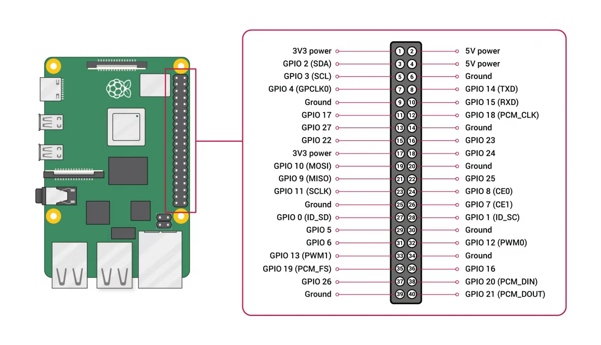

# UCSMA Rate Control Protocol

This repo contains the rate control protocol for ucsma. It MUST be used in conjunction with the UCSMA unlocking protocol (kernel modules).

## Experiment Results
Below are the experiment results achieved through testing the UCSMA rate control protocol (along with the UCSMA unlocking protocol) on the three node topology.

For each unlocking period T (T = 20,000/60,000/10,000/150,000/200,000 microseconds), we plotted 3 graphs:

i. The dot plot shows the packet transmission timestamps for each node ie. a dot indicates a packet was sent from the node, and each blue vertical line corresponds to an unlock signal; the x-axis corresponds to time in microseconds.

ii. The bar chart shows the average throughput of each node in kbps (calculated over a total of 5000 packets sent from all nodes; each packet is roughly 1kb).

iii. The line graph shows the buffer size at each node upon receiving the unlock signal ie. updates every T microseconds; the x-axis corresponds to time in microseconds, and the y-axis corresponds to the number of packets in the buffer.

### A. T = 20,000 microseconds
#### Graph A.i

#### Graph A.ii

#### Graph A.iii


### B. T = 60,000 microseconds
#### Graph B.i

#### Graph B.ii

#### Graph B.iii


### C. T = 100,000 microseconds
#### Graph C.i

#### Graph C.ii

#### Graph C.iii


### D. T = 150,000 microseconds
#### Graph D.i

#### Graph D.ii

#### Graph D.iii


### E. T = 200,000 microseconds
#### Graph E.i

#### Graph E.ii

#### Graph E.iii


## Topology Setup
### Install ath9k module
1. Copy the relevant files to the AR9331 boards.
2. Install ath9k module with command `insmod ath9k`. (default model) Uninstall ath9k module with command `rmmod ath9k`.
3. Set noise floor and txpower by running `init.sh` script sometimes the noise floor need to be set angin manully after running `init.sh` script. Left and Right nodes with noise floor = -56 and txpower = 100 while the mid node with noise floor = -95 and txpower = 2000.
4. Run packetspammer on three boards with command e.g. `./packetspammer -d0 mon0`. 
5. Run horst on three boards with command e.g. `horst -i mon0` (horst can be helpful when adjusting the topology.)
6. Observe the throughput of each device to make sure the topology holds.

### Install unlock module and rate control module
1. Copy the relevant files to the AR9331 boards.
2. Run packetspammer before install unlock module by command e.g. `./packetspammer -d0 mon0` to send a packet first.
3. Install unlock module with command `insmod unlock.ko`.
4. Install buffer_number module with command `insmod buffer_number.ko`.
5. Set parameters for unlock module. (T and Delta) The default values of these two parameters are (T = 20000 microsecond, Delta = 100 microsecond) with command `echo $1 > /sys/module/unlock/parameters/T` and `echo $1 > /sys/module/unlock/parameters/Delta`.
6. Run packetspammer with command e.g. `./packetspammer -d0 mon0` and observe the result with Raspberry Pi or by the printed throughput by packetspammer.

### Unlock Wire Connection
#### Raspberry Pi pin Assignment


#### Unlock Wire Connection


## How to Compile
TODO: Write a script to automate this process

Below are instructions to compile each of the components, which must be done separately.

### Packetspammer
To compile packetspammer, first copy all contents of the `packetspammer` directory within the `ucsma-rate-control` repo to `ucsma/packetspammer/`.

Next, run the following commands:
```
PROJECT_ROOT="./ucsma"
BUILD_DIR="$PROJECT_ROOT/build_dir"

# compile packetspammer                                                                                                                                                             
LPCAP="$PROJECT_ROOT/OpenWRT-14.07-JS9331/build_dir/target-mips_34kc_uClibc-0.9.33.2/libpcap-1.5.3/"
LPTHREAD="$PROJECT_ROOT/OpenWRT-14.07-JS9331/build_dir/toolchain-mips_34kc_gcc-4.8-linaro_uClibc-0.9.33.2/uClibc-0.9.33.2/lib/libpthread.so"
LIBS="-L$LPCAP -L$LPTHREAD"

ucsma/build_dir/toolchain/OpenWrt-Toolchain-ar71xx-for-mips_34kc-gcc-4.8-linaro_uClibc-0.9.33.2/toolchain-mips_34kc_gcc-4.8-linaro_uClibc-0.9.33.2/bin/mips-openwrt-linux-gcc -Wall radiotap.c packetspammer.c -o packetspammer $LIBS -lpcap -ldl -lpthread -std=gnu99
```
And the result `packetspammer` can then be found in your current working directory. Note that you may need to alter some of the paths in the above code snippet to get it to work.

### ath9k.ko
To compile the `ath9k.ko` kernel module (network driver) that supports the rate control protocol, copy all `.c` and `.h` files from the `ath9k` direction in the `ucsma-rate-control` repo to `ucsma/OpenWRT-14.07-JS9331/build_dir/target-mips_34kc_uClibc-0.9.33.2/linux-ar71xx_generic/compat-wireless-2014-05-22/drivers/net/wireless/ath/ath9k` (from the main repo), which should be present after running `./build.sh`.

Then, `cd` to `ucsma/OpenWRT-14.07-JS9331` and run `make package/compile`.

Finally, you should be able to find the compiled `ath9k.ko` kernel module in `ucsma/OpenWRT-14.07-JS9331/staging_dir/target-mips_34kc_uClibc-0.9.33.2/root-ar71xx/lib/modules/3.10.49/ath9k.ko`.

### unlock.ko
To compile the `unlock.ko` kernel module (to send unlock signals), copy all files from the `kernel-module` directory of the `ucsma-rate-control` repo into the `ucsma/build_dir/ath/ath9k/` directory (which should be present if you have successfully run `build.sh` at least once) and run `build.sh`.

The resulting `unlock.ko` should be present at `ucsma/result/modules/unlock.ko`.
